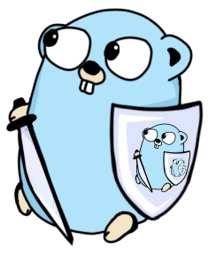

# go-ruleguard


[](https://pkg.go.dev/mod/github.com/quasilyte/go-ruleguard)
[](https://goreportcard.com/report/github.com/quasilyte/go-ruleguard)



## Overview

[analysis](https://godoc.org/golang.org/x/tools/go/analysis)-based Go linter that runs dynamically loaded rules.

You write the rules, `ruleguard` checks whether they are satisfied.

`ruleguard` has some similarities with [GitHub CodeQL](https://securitylab.github.com/tools/codeql), but only focuses on Go code queries.

**Features:**

* Custom linting rules without re-compilation and Go plugins.
* Diagnostics are written in a declarative way.
* [Quickfix](_docs/gorules.md#suggestions-quickfix-support) actions support.
* Powerful match filtering features, like expression [type pattern matching](_docs/gorules.md#type-pattern-matching).

`ruleguard` comes with [rules.go](rules.go) file that can be used as a foundation to write your own rules file.

It can also be easily embedded into other static analyzers. [go-critic](https://github.com/go-critic/go-critic) can be used as an example.

## Quick start

To install `ruleguard` binary under your `$(go env GOPATH)/bin`:

```bash
$ go get -v -u github.com/quasilyte/go-ruleguard/...
```

If `$GOPATH/bin` is under your system `$PATH`, `ruleguard` command should be available after that.<br>

```bash
$ ruleguard -help
ruleguard: execute dynamic gogrep-based rules

Usage: ruleguard [-flag] [package]

Flags:
  -rules string
    	path to a rules.go file
  -e string
    	execute a single rule from a given string
  -fix
    	apply all suggested fixes
  -c int
    	display offending line with this many lines of context (default -1)
  -json
    	emit JSON output
```

Create a test `example.rules.go` file:

```go
// +build ignore

package gorules

import "github.com/quasilyte/go-ruleguard/dsl"

func dupSubExpr(m dsl.Matcher) {
	m.Match(`$x || $x`,
		`$x && $x`).
		Where(m["x"].Pure).
		Report(`suspicious identical LHS and RHS`)
}

func boolExprSimplify(m dsl.Matcher) {
	m.Match(`!($x != $y)`).Suggest(`$x == $y`)
	m.Match(`!($x == $y)`).Suggest(`$x != $y`)
}
```

Create a test `example.go` target file:

```go
package main

func main() {
	var v1, v2 int
	println(!(v1 != v2))
	println(!(v1 == v2))
	if v1 == 0 && v1 == 0 {
		println("hello, world!")
	}
}
```

Run `ruleguard` on that target file:

```bash
$ ruleguard -rules example.rules.go -fix example.go
example.go:5:10: hint: suggested: v1 == v2
example.go:6:10: hint: suggested: v1 != v2
example.go:7:5: error: suspicious identical LHS and RHS
```

Since we ran `ruleguard` with `-fix` argument, both **suggested** changes are applied to `example.go`.

There is also a `-e` mode that is useful during pattern debugging:

```bash
$ ruleguard -e 'm.Match(`!($x != $y)`)' example.go
example.go:5:10: !(v1 != v2)
```

It automatically inserts `Report("$$")` into the specified pattern.

You can use `-debug-group <name>` flag to see explanations
on why some rules rejected the match (e.g. which `Where()` condition failed).

The `-e` generated rule will have `e` name, so it can be debugged as well.

## How does it work?

`ruleguard` parses [gorules](_docs/gorules.md) (e.g. `rules.go`) during the start to load the rule set.  
Loaded rules are then used to check the specified targets (Go files, packages).  
The `rules.go` file itself is never compiled, nor executed.

A `rules.go` file, as interpreted by a [`dsl`](https://godoc.org/github.com/quasilyte/go-ruleguard/dsl) API, is a set of functions that serve as a rule groups. Every function accepts a single [`dsl.Matcher`](https://godoc.org/github.com/quasilyte/go-ruleguard/dsl#Matcher) argument that is then used to define and configure rules inside the group.

A rule definition always starts from a [`Match(patterns...)`](https://godoc.org/github.com/quasilyte/go-ruleguard/dsl#Matcher.Match) method call and ends with a [`Report(message)`](https://godoc.org/github.com/quasilyte/go-ruleguard/dsl#Matcher.Report) method call.

There can be additional calls in between these two. For example, a [`Where(cond)`](https://godoc.org/github.com/quasilyte/go-ruleguard/dsl#Matcher.Where) call applies constraints to a match to decide whether its accepted or rejected. So even if there is a match for a pattern, it won't produce a report message unless it satisfies a `Where()` condition.

To learn more, check out the documentation and/or the source code.

## Documentation

* [Ruleguard by example](https://go-ruleguard.github.io/by-example/) tour
* Example rule files: [rules.go](rules.go)
* Another great example: [github.com/dgryski/semgrep-go/ruleguard.rules.go](https://github.com/dgryski/semgrep-go/blob/master/ruleguard.rules.go)
* [gorules](_docs/gorules.md) format documentation
* [dsl package](https://godoc.org/github.com/quasilyte/go-ruleguard/dsl) reference
* [ruleguard package](https://godoc.org/github.com/quasilyte/go-ruleguard/ruleguard) reference
* Introduction article: [EN](https://quasilyte.dev/blog/post/ruleguard/), [RU](https://habr.com/ru/post/481696/)

## Extra references

* Online ruleguard playground: [go-ruleguard.github.io/play](https://go-ruleguard.github.io/play)
* [gogrep](https://github.com/mvdan/gogrep) - underlying AST matching engine
* [NoVerify: Dynamic Rules for Static Analysis](https://medium.com/@vktech/noverify-dynamic-rules-for-static-analysis-8f42859e9253)
* [Ruleguard comparison with Semgrep and CodeQL](https://speakerdeck.com/quasilyte/ruleguard-vs-semgrep-vs-codeql)
